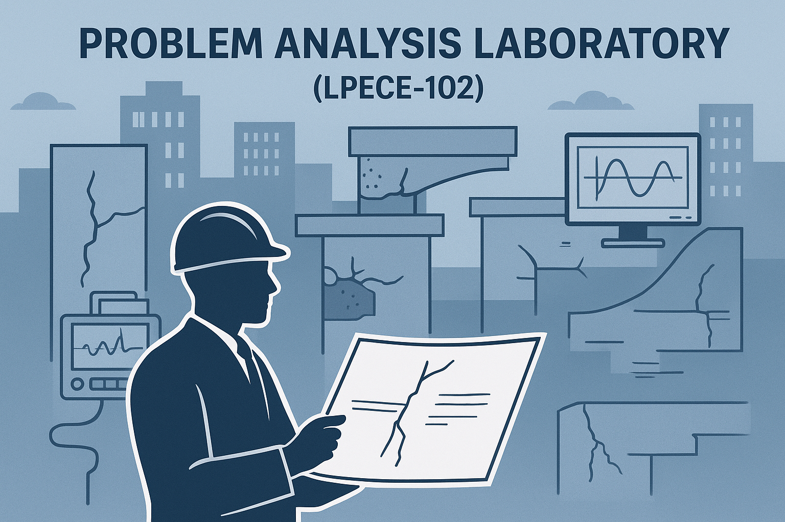

# Problem Analysis Laboratory _(Structural Engineering)_

| **[Contents](Contents/Content.md)** | **[Syllabus](Contents/Syllabus.md)** | **[Guidelines](Contents/Guidelines.md)** | **[IS Codes](Contents/Codes.md)** | **[Contact](Contents/Contact.md)** | 

**[Notifications](https://gndec-yjs.github.io/PAL/)**

🚨 Experiment 0 ➝ Due Date: October 3, 2025 (Friday), 11:59 PM.  - [Click here to submit Experiment 0](https://forms.gle/Zypd8xLm1s4rauiv6)
  

🚨 Experiments 1–4 ➝ Due Date: October 3, 2025 (Friday), 11:59 PM. - [Click here to submit Experiments 1–4](https://forms.gle/d9Akfj8wJB4F47pE8)

 

---

*Disclaimer: All rights and credits reserved to the respective owner(s) of the uploaded content/images. The uploaded content is solely for educational purpose. If you are the main copyright owner, contact to claim credit or content removal.*

---
